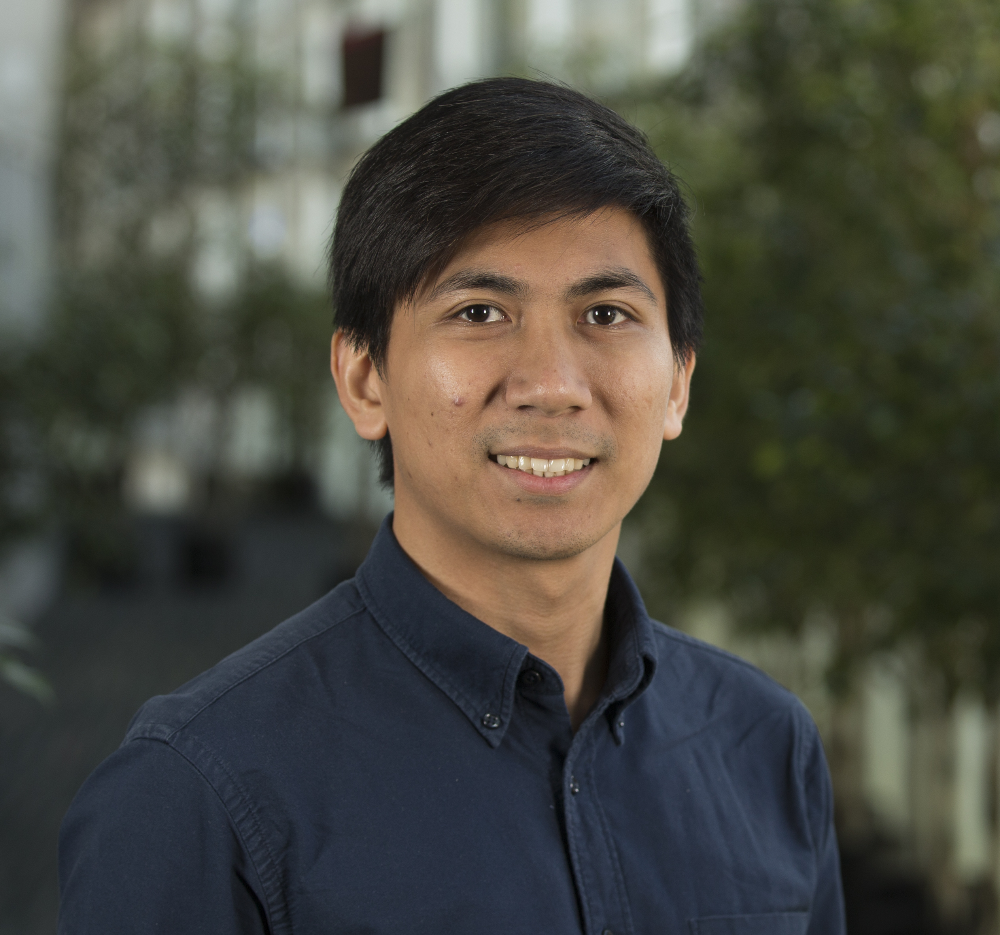

---
# You don't need to edit this file, it's empty on purpose.
# Edit theme's home layout instead if you wanna make some changes
# See: https://jekyllrb.com/docs/themes/#overriding-theme-defaults
layout: page
---

## Welcome!

I’m a Ph.D. candidate at the Graduate School of Systems Information Science at [Future University Hakodate](https://www.fun.ac.jp/en/), Japan. I am a Japanese Government (MEXT) scholar under the supervision of [Prof. Yasuyuki Sumi](http://www.fun.ac.jp/~sumi/) in the Interaction Media Lab. My [research](/research/) focuses on the integration of human-computer interaction and complex systems research in developing civic solutions. 

Concurrently, I am an Assistant Professor of Computer Science in the College of Computer Studies at [De La Salle University](https://www.dlsu.edu.ph/), Philippines. I founded the [Center for Complexity and Emerging Technologies (COMET)](http://comet.dlsu.edu.ph) and is now the head of its Civic Services group.

## Research

For my PhD, I'm exploring novel navigation and wayfinding applications for connected drivers and commuters that can influence their mobility patterns towards more livable and sustainable cities.

Outside of my PhD program, my [research](/research/) spans a broad range of topics in complex systems, human-computer interaction and civic computing, including: reflective spaces, transportation, collaboration and social networks, crowd dynamics, multi-criteria modeling and optimization, and civic solutions for mobility, transportation, and disaster awareness and preparedness. For more detailed information, please see the full-text versions of my [publications](/publications/) and my latest [curriculum vitae](/cv/). If you interested to collaborate, please contact me via [email](mailto:{{site.email}}).